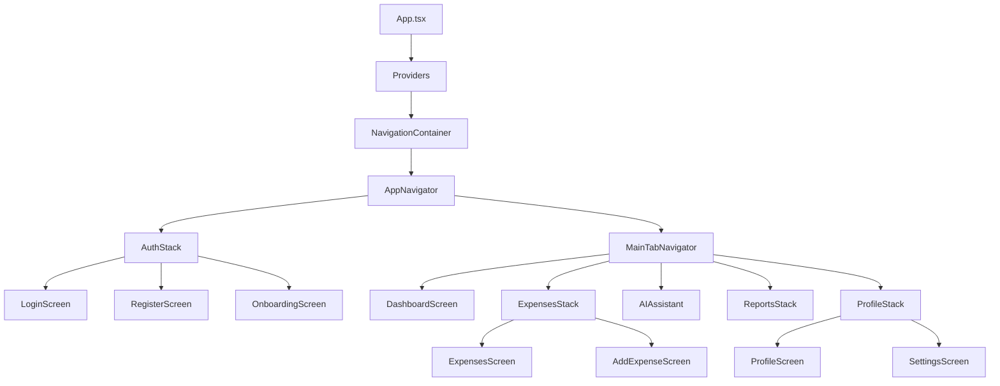

# Project Index: FinWise

This document provides a comprehensive overview of the **FinWise** project, a React Native application built with Expo for personal finance management.

## 🏗 Architecture Overview

- **Framework**: [Expo](https://expo.dev/) (SDK 54)
- **UI Component Library**: [React Native Paper](https://reactnativepaper.com/) (Material Design 3)
- **State Management**: [Redux Toolkit](https://redux-toolkit.js.org/)
- **Navigation**: [React Navigation](https://reactnavigation.org/) (Stack + Bottom Tabs)
- **Charts**: [Victory Native](https://formidable.com/open-source/victory-native/)
- **Icons**: `@expo/vector-icons` (Ionicons, MaterialCommunityIcons)

---

## 📁 Project Structure

```text
finwise/
├── App.tsx                 # Root component with Providers (Redux, Paper, Navigation)
├── app.json                # Expo configuration
├── assets/                 # Static assets (fonts, icons, splash)
└── src/
    ├── components/         # Reusable UI components
    │   ├── ai/             # AI Assistant specific components
    │   ├── charts/         # Spending charts (Pie, Line)
    │   ├── common/         # Generic UI (Card, Button, Header)
    │   ├── expenses/       # Expense list items and cards
    │   └── settings/       # Settings-related controls
    ├── hooks/              # Custom React hooks
    ├── navigation/         # Navigation configuration and types
    │   ├── AppNavigator.tsx     # Main Stack switcher (Auth vs Main)
    │   ├── AuthStack.tsx        # Login/Register flow
    │   ├── MainTabNavigator.tsx # Primary Bottom Tab Navigation
    │   └── types.ts             # Navigation param list types
    ├── redux/              # Global state management
    │   ├── slices/         # Redux Slices (auth, expenses, budget, ai, ui)
    │   └── store.ts        # Store configuration
    ├── screens/            # Application screens
    │   ├── auth/           # Onboarding, Login, Register
    │   ├── expense/        # Add/Edit Expense
    │   ├── main/           # Dashboard, Budget, AI Assistant
    │   ├── profile/        # Profile, Settings, Change Password
    │   └── reports/        # Spending reports
    ├── services/           # External API / Mock data
    └── utils/              # Helper functions, themes, and constants
        ├── theme.ts        # Theme definitions (COLORS, MD3Theme)
        └── validators.ts   # Form validation logic
```

---

## 🗺 Navigation Structure



---

## ⚡ Global State (Redux)

| Slice | Description | Key State |
| :--- | :--- | :--- |
| `auth` | User authentication & profile | `user`, `isAuthenticated`, `token` |
| `expenses` | Expense records & categories | `expenses[]`, `categories[]`, `loading` |
| `budget` | Monthly budgets & limits | `budgets[]`, `totalBudget` |
| [ai](file:///n:/Prjects_AI/finwise/App.tsx#11-26) | AI Assistant interaction | `messages[]`, `isTyping` |
| `ui` | Theme & global UI state | `theme` (light/dark), `loading` |

---

## 🎨 Design System

- **Themes**: Consists of `lightTheme` and `darkTheme` defined in [src/utils/theme.ts](file:///n:/Prjects_AI/finwise/src/utils/theme.ts).
- **Colors**: Primary color is a deep green (`#2E7D32`).
- **StatusBar**: Dynamically follows the theme background and text/icon style (configured in [App.tsx](file:///n:/Prjects_AI/finwise/App.tsx)).

## 🛠 Core Dependencies

- `react-native-paper`: Version 5.15.0
- `@reduxjs/toolkit`: Version 2.11.2
- `victory-native`: Version 41.20.2
- `expo-status-bar`: Version 3.0.9
